# DIO | Bootcamp Microsoft Azure AI Fundamentals
# Reconhecimento Facial e transformação de imagens em Dados no Azure ML

## Imagem 1

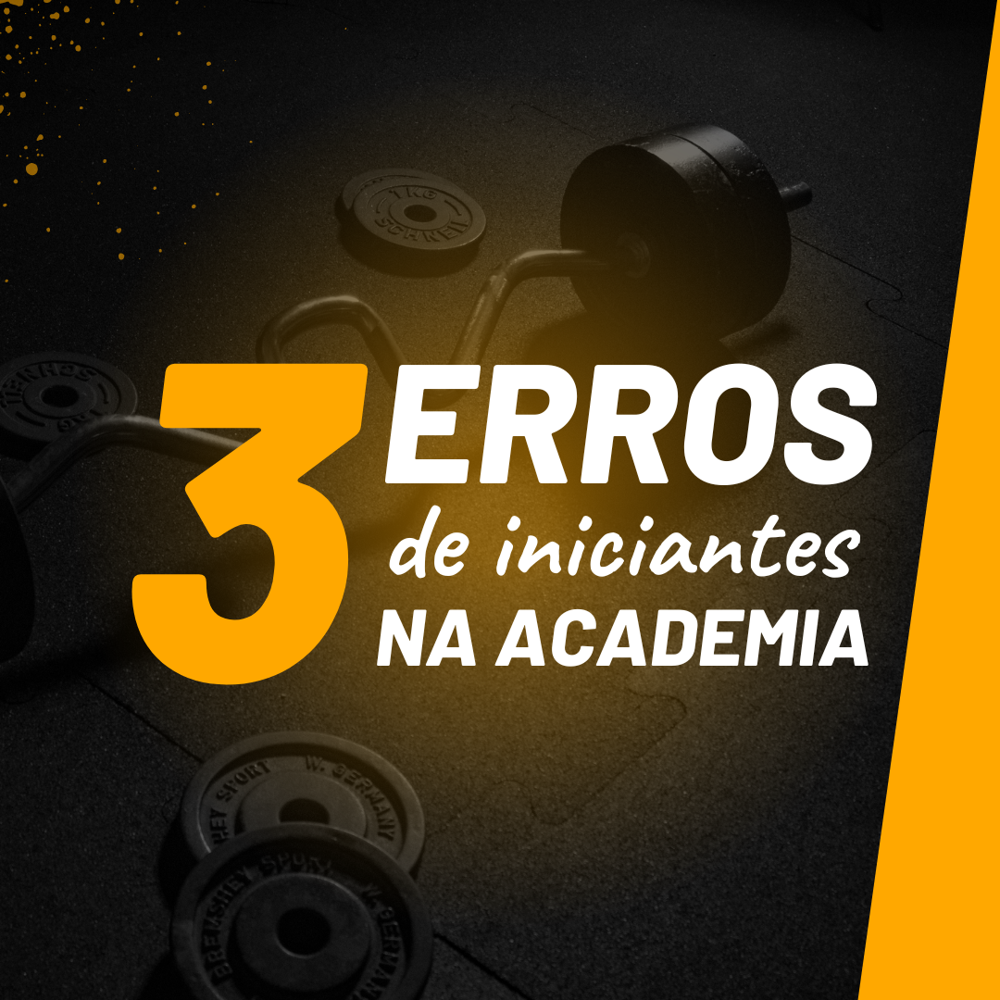

1.1. OCR | Atributos detectados:

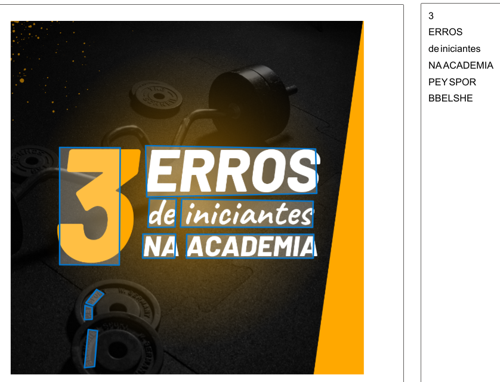

1.2. Add captions to images | Atributos detectados:

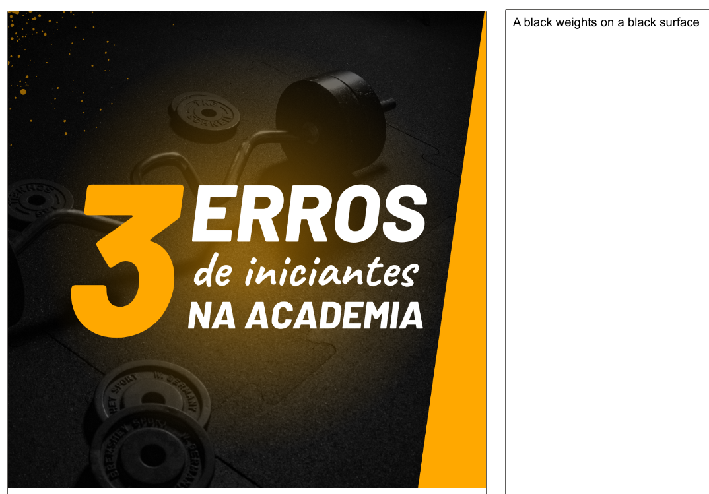

1.3. Detect faces in an image | Atributos detectados:

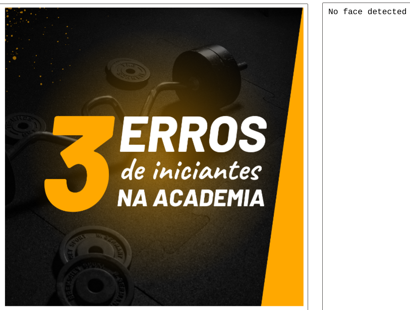

## Imagem 2

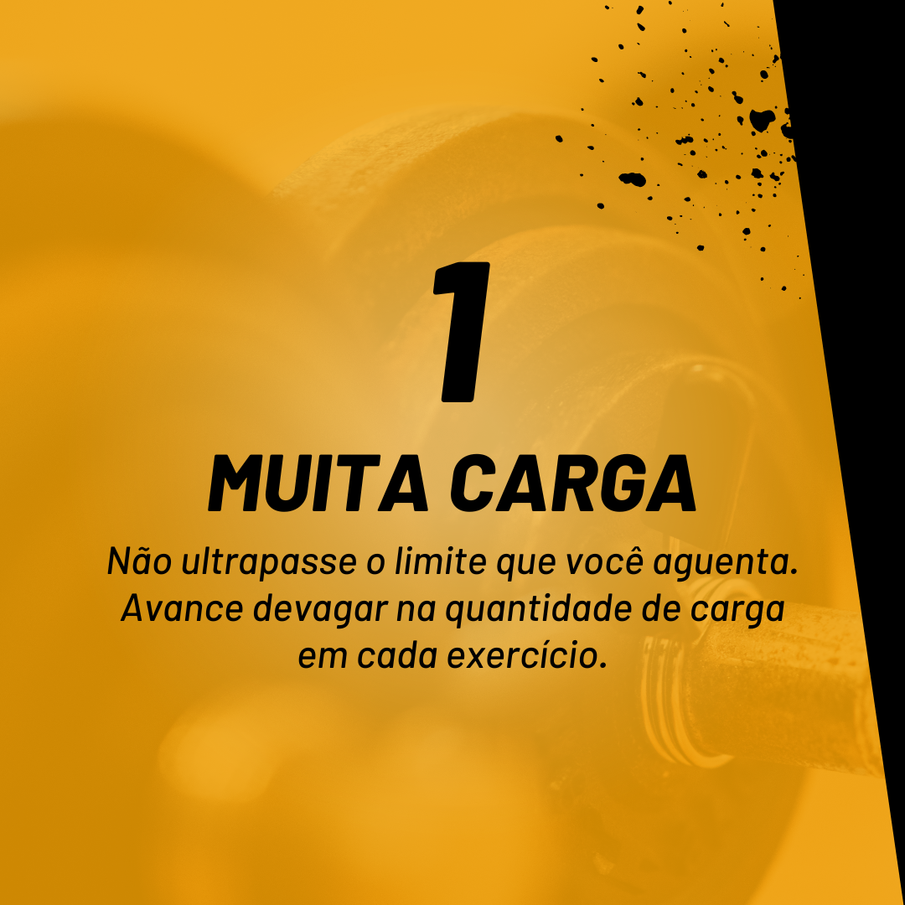

2.1. OCR | Atributos detectados:

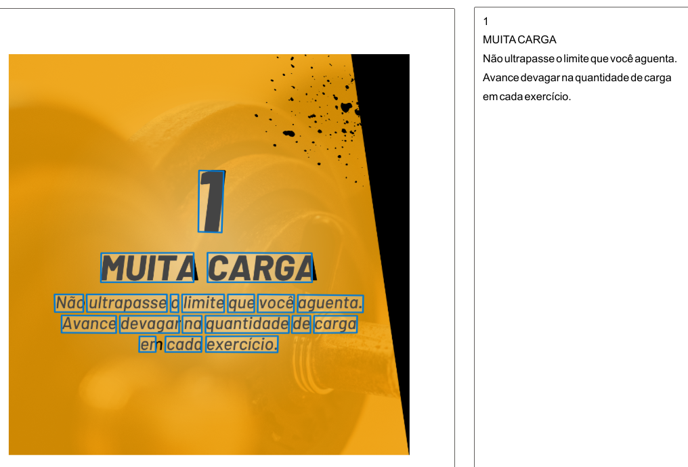

2.2. Add captions to images | Atributos detectados:

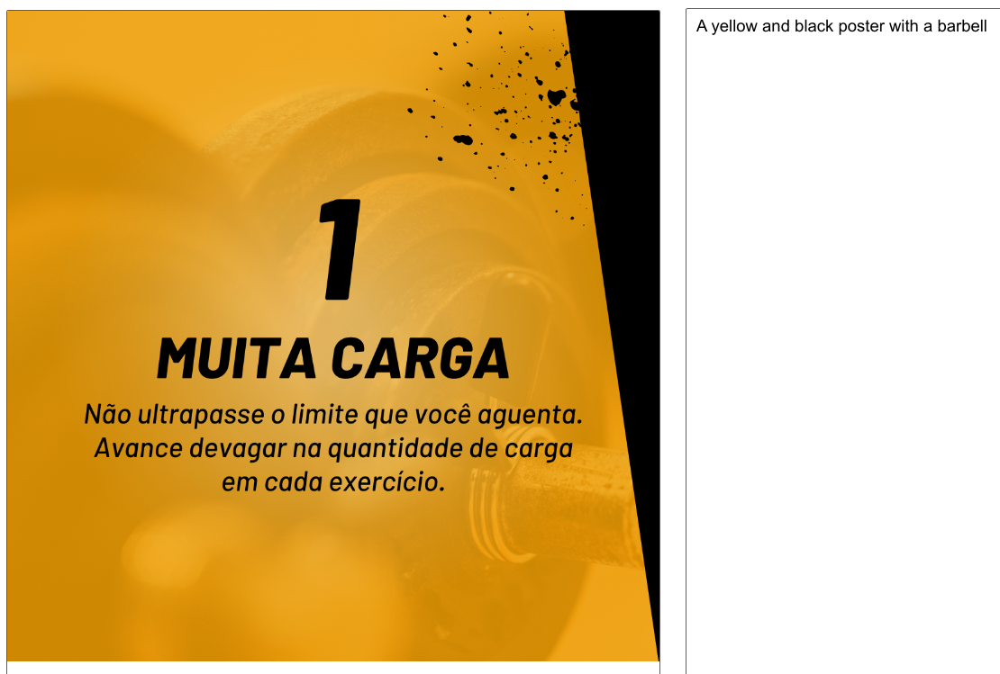

2.3. Detect faces in an image | Atributos detectados:

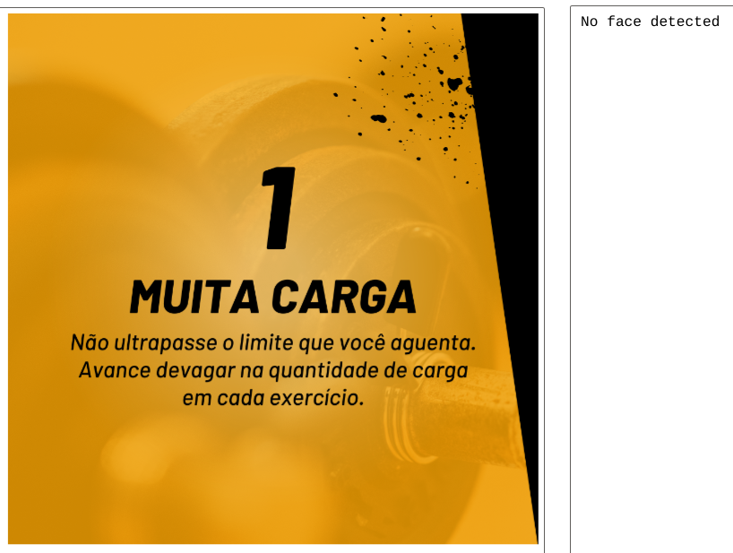

## Imagem 3

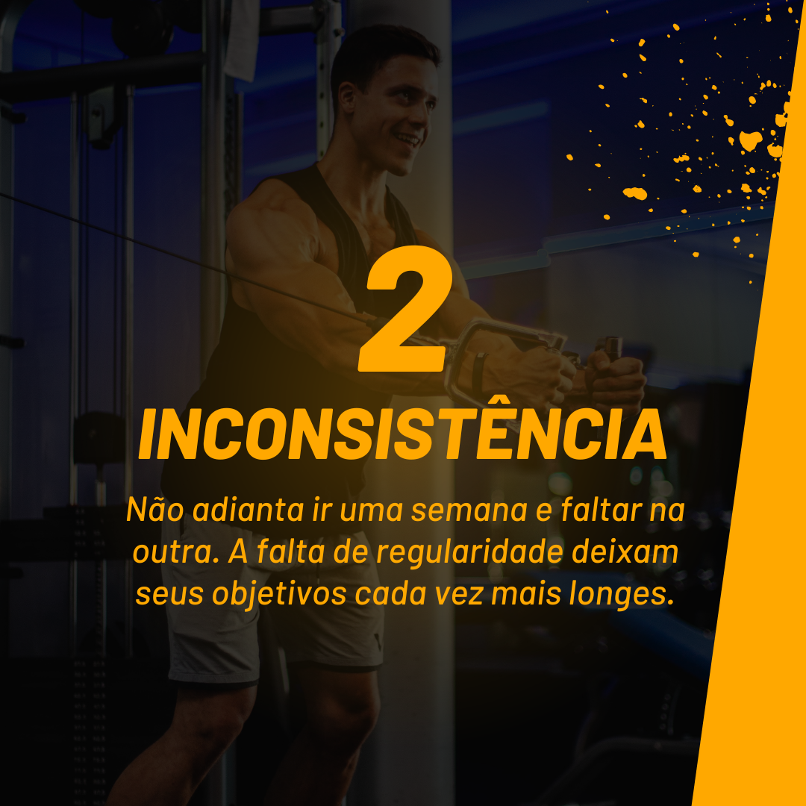

3.1. OCR | Atributos detectados:

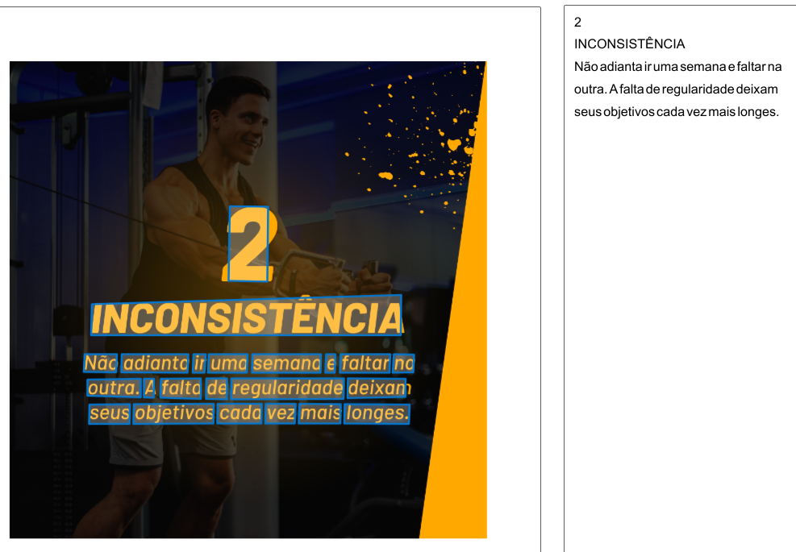

3.2. Add captions to images | Atributos detectados:

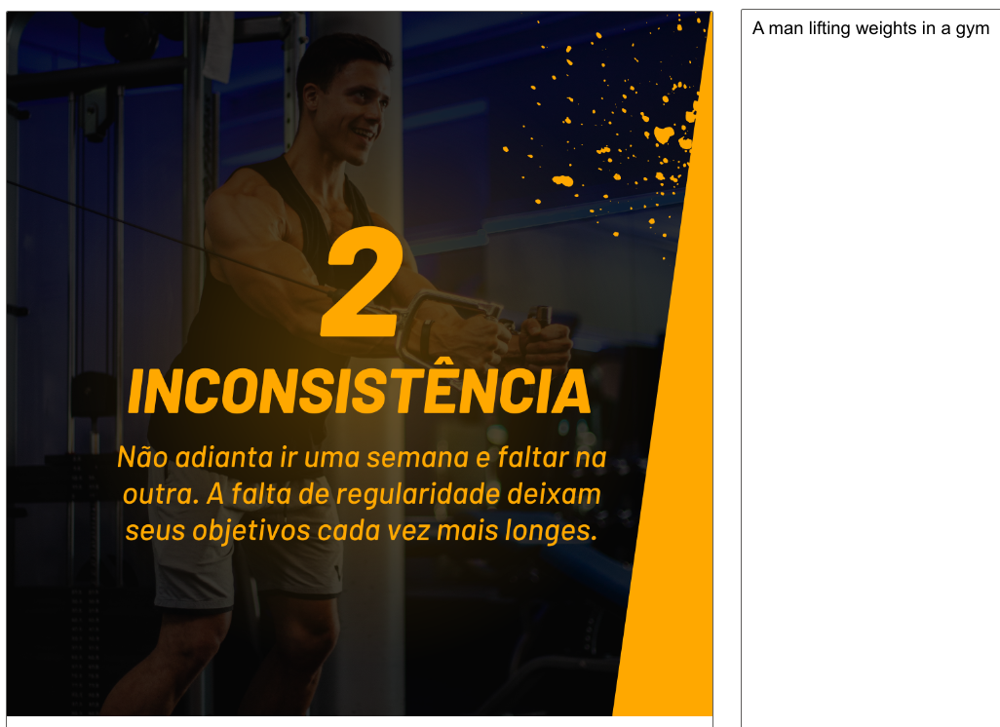

3.3. Detect faces in an image | Atributos detectados:

## Imagem 4

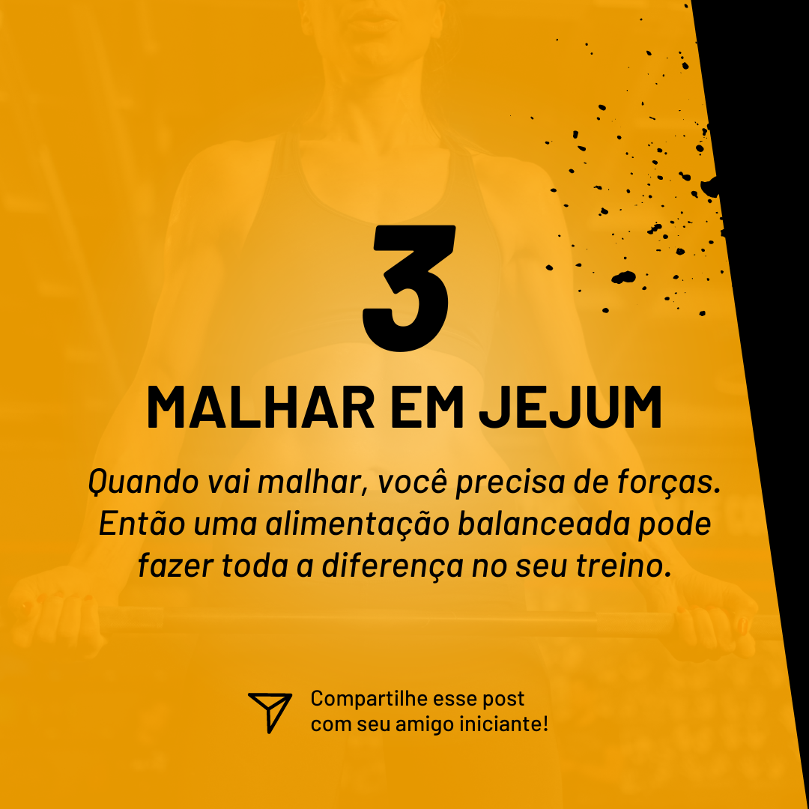

4.1. OCR | Atributos detectados:

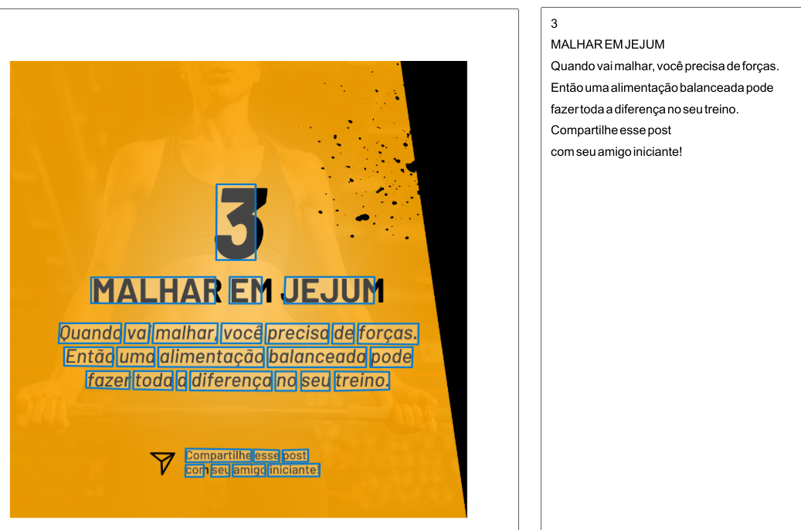

4.2. Add captions to images | Atributos detectados:

4.3. Detect faces in an image | Atributos detectados:

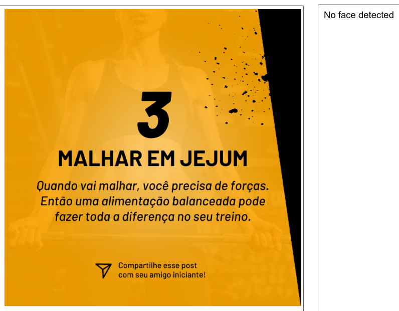
