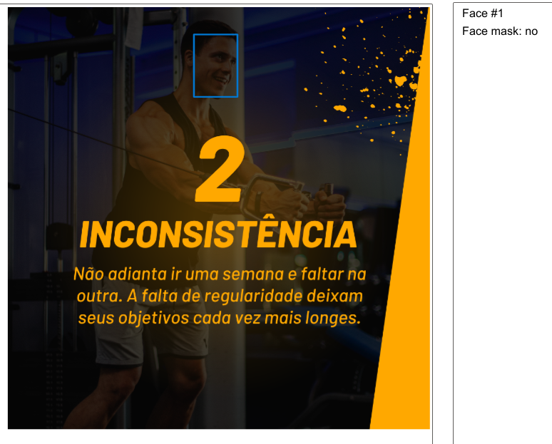
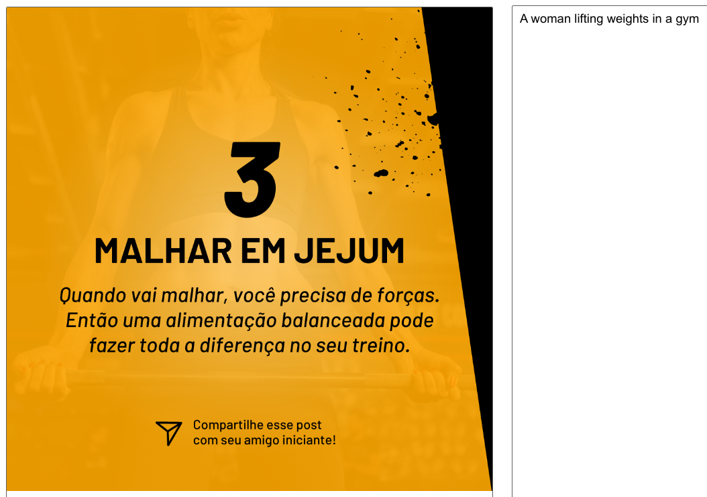

# DIO | Bootcamp Microsoft Azure AI Fundamentals
# Reconhecimento Facial e transformação de imagens em Dados no Azure ML

## Imagem 1

1.1. OCR | Atributos detectados:

1.2. Add captions to images | Atributos detectados:

1.3. Detect faces in an image | Atributos detectados:

## Imagem 2

2.1. OCR | Atributos detectados:

2.2. Add captions to images | Atributos detectados:

2.3. Detect faces in an image | Atributos detectados:

## Imagem 3

3.1. OCR | Atributos detectados:

3.2. Add captions to images | Atributos detectados:

3.3. Detect faces in an image | Atributos detectados:

## Imagem 4

4.1. OCR | Atributos detectados:

4.2. Add captions to images | Atributos detectados:

4.3. Detect faces in an image | Atributos detectados:

